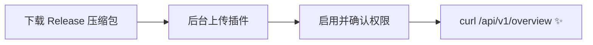

<div align="center">

# Komari Open API

_把 [Komari](https://github.com/komari-monitor/komari) 探针控制台里的服务器状态，变成规范的 REST API_

[](LICENSE)
[](https://github.com/komari-monitor/komari)
[](https://mimokit.github.io/komari-api/)

控制台能看到的，`/api/v1` 就能查到 —— 机器人插件、脚本、自建面板，一个 GET 渲染一张状态卡。

</div>

## 为什么需要它

Komari 的服务器状态只能登录控制台看，没有对外的查询接口。想让机器人回一句「东京节点现在 CPU 多少」、想在自己的页面嵌一块状态卡，都无从下手。

这个插件补上了这一块：装上即用，全部数据实时读自面板，零额外存储。

## 特性

- **开箱即用** —— 上传插件、点击启用，API 直接挂在你绑定面板的域名下：`https://面板域名/api/v1/...`
- **一次拿全** —— `GET /api/v1/overview` 返回站点信息、汇总统计与全部节点实时状态
- **视角收敛** —— 匿名访客看不到隐藏节点；令牌 / 管理员看到完整数据；Agent Token 等敏感字段永远不出现在响应里
- **浏览器友好** —— 全 GET 语义、标准状态码、CORS 支持
- **数据零搬运** —— 实时读自面板自身，不落地、不建表、无定时任务

## 快速开始



1. 在 [Releases](https://github.com/MimoKit/komari-api/releases) 下载 `komari-plugin-api.zip`
2. 面板管理后台 → **插件** → 安装，上传并启用（需要两项权限：注册路由、调用系统 RPC）
3. 验证：

```bash
curl https://你的面板域名/api/v1/overview
```

## 接口总览

| 方法 | 路径 | 说明 |
| --- | --- | --- |
| GET | `/api/v1` | 接口索引与版本信息 |
| GET | `/api/v1/overview` | 站点信息 + 汇总统计 + 全部节点实时状态 |
| GET | `/api/v1/nodes` | 节点列表，`?group=` 过滤、`?live=false` 关闭实时 |
| GET | `/api/v1/nodes/{uuid}` | 节点详情 |
| GET | `/api/v1/nodes/{uuid}/records` | 历史负载记录，`?hours=24&load_type=cpu` |
| GET | `/api/v1/ping/tasks` | Ping 任务列表 |
| GET | `/api/v1/ping/records` | Ping 记录，`?uuid=` / `?task_id=` |

```json
{
  "name": "东京节点 · JP-01",
  "online": true,
  "live": {
    "cpu": 23.5,
    "ram": { "used": 12884901888, "total": 34359738368 },
    "network": { "down": 48234496, "up": 12582912 },
    "ping": { "日本 → Cloudflare": { "avg": 44, "loss": 0 } }
  }
}
```

完整的字段说明、鉴权方式与机器人卡片示例见 **[中文文档](https://mimokit.github.io/komari-api/)**。

## 环境要求

- Komari `>= 1.0.0`（需要插件系统，建议使用最新版）

## 开源协议

[MIT](LICENSE)
